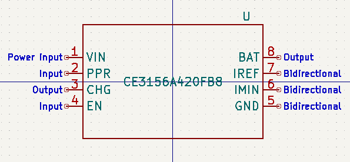


## Table of Contents

- [Overview](#overview)
- [Pin Descriptions](#pin-descriptions)
- [Contributing](#contributing)
- [License](#license)

# Overview

This repository contains the schematic symbols for the CE3156 Series chips, a line of high input voltage single cell chargers with OVP.

_Footprints and 3D models are not yet available, contributations are welcome._

Please note that while every effort has been made to ensure accuracy, the symbols provided in this library may contain errors or inaccuracies. The contributors and maintainers of this library cannot guarantee the correctness or completeness of the information provided. Therefore, users are advised to independently verify the symbols and designs before use.

# Contributing

Contributions to improve the accuracy and completeness of the symbols are welcome and encouraged. If you discover any errors or have suggestions for improvements, please consider contributing by submitting a pull request. By contributing to this repository, you agree to license your contributions under the same terms as the original project.

# Pin Descriptions

| Pin        | Number  | Description                                         |
|------------|-------|-----------------------------------------------------|
| VIN  | 1 | Power Input. The absolute maximum input voltage is 26.5V. A 1μF or larger value X5R ceramic capacitor is recommended to be placed very close to the input pin for decoupling purpose. Additional capacitance may be required to provide a stable input voltage. |
| PPR  | 2 | Open-Drain Power Presence Indication. The open-drain MOSFET turns on when the input voltage is above the POR threshold but below the OVP threshold and off otherwise. This pin is capable to sink15mA current to drive an LED. The maximum voltage rating for this pin is 5.5V. This pin is independent on the EN pin input. |
| CHG  | 3 | Open-Drain Charge Indication. This pin outputs a logic low when acharge cycle starts and turns to high impedance when thefull-of-charge (FOC) condition is qualified. This pin is capable tosink 15mA current to drive an LED. When the charger is disabled, the CHG pin outputs high impedance. |
| EN   | 4 | Enable Input. This is a logic input pin to disable or enable the charger. Drive to high to disable the charger. When this pin is driven to low or left floating, the charger is enabled. This pin has an internal 200kΩ pull-down resistor. |
| GND  | 5 | System Ground. |
| IMIN | 6 | Full-of-Charge (FOC) Current Programming Pin. Connect a resistor between this pin and the GND pinto set the FOC current. The FOC current IMIN can be programmed by the following equation where RIMIN is in kΩ. `Imin = 10960 / Rimin(mA)` |
| IREF | 7 | Charge-Current Programming and Monitoring Pin. Connect a resistor between this pin and the GND pin to set the charge current limit determined by the following equation where RIREF is in kΩ. The resistor should be located very close to this pin. The IREF pin voltage also monitors the actual charge current during the entire charge cycle, including the trickle, constant-current, and constant-voltage phases. When disabled, VIREF = 0V. `Iref = 11980 / Riref + 0.6(mA)` |
| BAT  | 8 | Charger Output Pin. Connect this pin to the battery. A 1μF or larger X5R ceramic capacitor is recommended for decoupling and stability purposes. When the EN pin is pulled to logic high, the BAT output is disabled. |

# License

Licensed under GNU GPL 2.0. See [License](LICENSE.md).